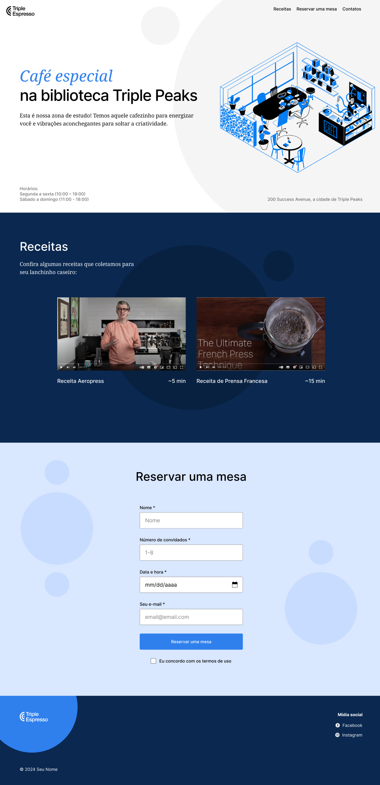
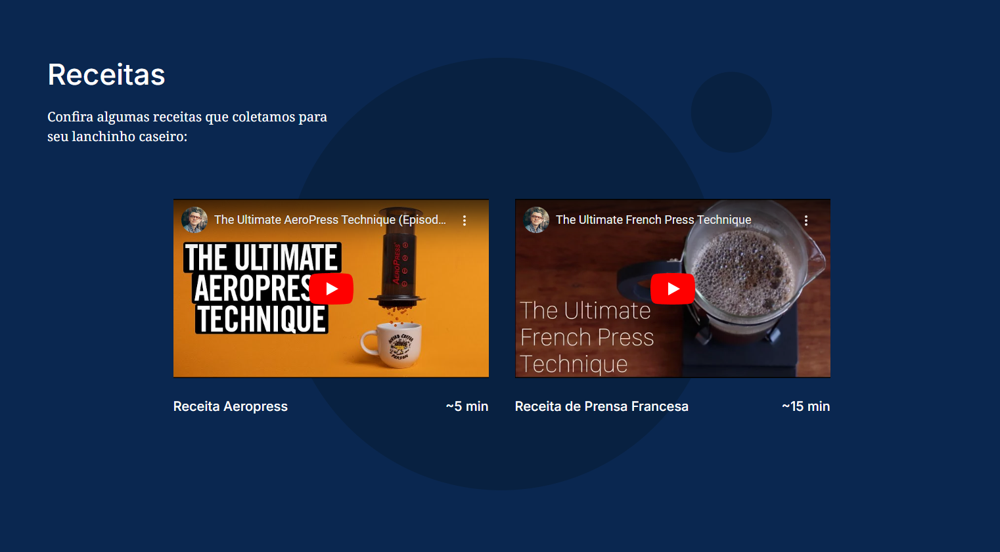
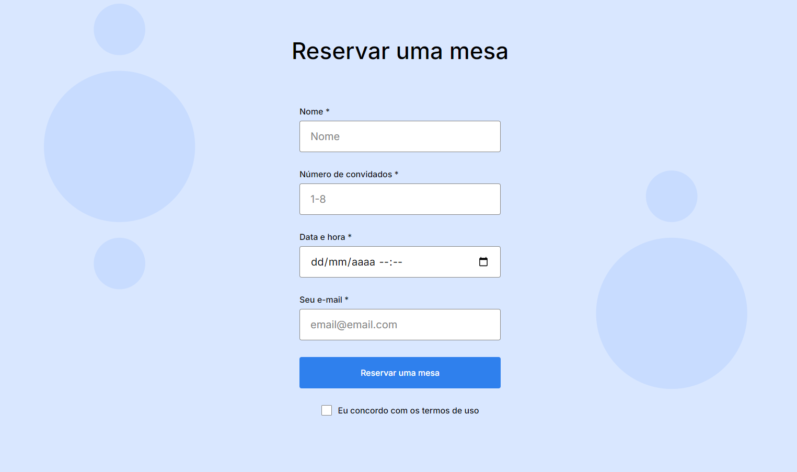
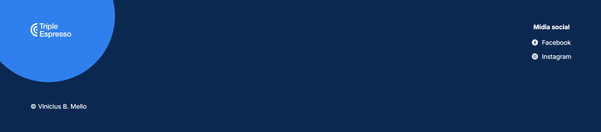

# Triple Espresso

A página Triple Espresso, é um projeto feito utilizando html e css com o menu de navegação e a descrição do café na biblioteca no header, o conteúdo do main dividido em seções com receitas de café, para reserva de mesa e o footer com informações das redes sociais e o copyright.

## Tecnologias

- HTML5 semântico
- Metologia BEM
- Flexbox
- Position
- Hover
- Iframe

## Header

É composto pelo menu de navegação e a descrição do café na biblioteca no cabeçalho, é utilizado `flexbox`, `position` para distribuir e posicionar o conteúdo e a pseudo-classe `hover` para alterar a cor dos links ao passar o cursor.

## Main

### Seção de Receitas

É utilizado o elemento `iframe` para incorporar os links dos videos explicativos das receitas e serem assistidos na seção sem ser redirecionado para fora da página.

### Seção de Reserva de Mesa

O elemento `<form>` é utilizado para criar o formulário de reserva de mesa. É utilizado o elemento `<input>`, com diferentes valores do atributo `type` para criar os campos de: nome, número de convidados (com limites mínimo e máximo), data, hora, e-mail e uma caixa de seleção para concordância com os termos. Todos os campos são marcados como obrigatórios usando o atributo `required` e um elemento de botão do tipo `submit` é utilizado para enviar os dados do formulário.

## Footer

É composto pela logo, links das redes sociais e o copyright, é utilizado `flexbox` para distribuir e posicionar o conteúdo e a pseudo-classe `hover` para alterar a cor dos links ao passar o cursor.

## Planos de melhoria do projeto

- Seção de avaliações para obter feedback dos usuários e obter criticas construtivas sobre o que pode ser melhorado no café.
