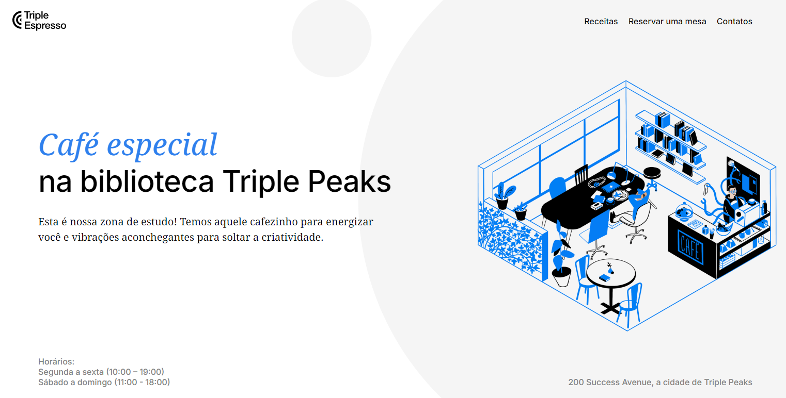

# Triple Espresso

**Triple Espresso** é um projeto de site desenvolvido com **HTML** e **CSS**, criado para um café fictício. A página inclui um menu de navegação e uma descrição sobre o café na biblioteca no header. O conteúdo principal está dividido em seções que apresentam receitas de café, um formulário para reserva de mesa e um rodapé com links para redes sociais e informações de copyright.

**Veja o projeto em execução clicando [aqui](https://vinimello90.github.io/web_project_coffeeshop/).**

## Tecnologias Utilizadas

- HTML5 semântico
- Metodologia BEM
- Flexbox
- Hover
- Iframe

## Descrição das Tecnologias e Técnicas Utilizadas

### HTML Semântico

O uso de `HTML semântico` torna o código mais legível e acessível, facilitando a manutenção e melhorando a compreensão do conteúdo.

### Metodologia BEM

A `metodologia BEM` (Bloco, Elemento, Modificador) foi aplicada para organizar as classes CSS, o que facilita a escalabilidade e a manutenção do código.

### Flexbox

A utilização de `Flexbox` garante melhor distribuição do layout e organiza os elementos de forma mais responsiva.

### Hover

A pseudo-classe `:hover` foi aplicada aos links e elementos interativos, proporcionando um feedback visual ao passar o cursor sobre eles.

### Iframe

A tag `iframe` foi utilizada para incorporar vídeos diretamente na página, permitindo que os usuários assistam ao conteúdo sem precisar ser redirecionados para outra página.

## Header

A seção de **header** inclui o menu de navegação e uma breve descrição sobre o café na biblioteca. Utilizamos `flexbox` para distribuir e organizar os elementos de forma responsiva, enquanto a pseudo-classe `hover` altera a cor dos links ao passar o cursor.

## Main

### Seção de Receitas

Na **seção de receitas**, foi utilizado o elemento `iframe` para incorporar vídeos explicativos das receitas de café. Isso permite que os usuários assistam aos vídeos diretamente na página sem precisar ser redirecionados para outra.

### Seção de Reserva de Mesa

Para a **seção de reserva de mesa**, criamos um formulário interativo com o elemento `<form>`. Os campos de entrada, como nome, número de convidados (com limites mínimo e máximo), data, hora, e-mail e a caixa de seleção para concordância com os termos, são todos obrigatórios (marcados com o atributo `required`). O formulário é enviado por meio de um botão `submit`.

## Footer

O **rodapé (footer)** contém a logo do café, links para as redes sociais e informações de copyright. Usamos `flexbox` para organizar os elementos, e a pseudo-classe `hover` altera a cor dos links ao passar o cursor.

## Planos de Melhoria

- Adicionar uma seção de **avaliações** para coletar feedback dos usuários e críticas construtivas sobre como o café pode ser aprimorado.
